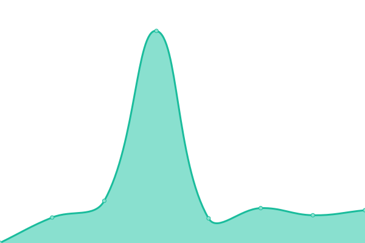

# [📈 Live Status](https://status.depoze.xyz): <!--live status--> **🟩 All systems operational**

This repository contains the open-source uptime monitor and status page for [CuSO4Deposit](https://status.depoze.xyz), powered by [Upptime](https://github.com/upptime/upptime).

With [Upptime](https://upptime.js.org), you can get your own unlimited and free uptime monitor and status page, powered entirely by a GitHub repository. We use [Issues](https://github.com/CuSO4Deposit/literate-journey/issues) as incident reports, [Actions](https://github.com/CuSO4Deposit/literate-journey/actions) as uptime monitors, and [Pages](https://status.depoze.xyz) for the status page.

<!--start: status pages-->
<!-- This summary is generated by Upptime (https://github.com/upptime/upptime) -->
<!-- Do not edit this manually, your changes will be overwritten -->
<!-- prettier-ignore -->
| URL | Status | History | Response Time | Uptime |
| --- | ------ | ------- | ------------- | ------ |
|  [Google](https://www.google.com) | 🟩 Up | [google.yml](https://github.com/CuSO4Deposit/literate-journey/commits/HEAD/history/google.yml) | 

 116ms
     
 | 

<a href="https://status.depoze.xyz/history/google">100.00%</a>
    

|  [API](https://api.depoze.xyz) | 🟩 Up | [api.yml](https://github.com/CuSO4Deposit/literate-journey/commits/HEAD/history/api.yml) | 

 2437ms
     
 | 

<a href="https://status.depoze.xyz/history/api">100.00%</a>
    

|  [Blog](https://blog.depoze.xyz) | 🟩 Up | [blog.yml](https://github.com/CuSO4Deposit/literate-journey/commits/HEAD/history/blog.yml) | 

 166ms
     
 | 

<a href="https://status.depoze.xyz/history/blog">100.00%</a>
    

|  [AI Chat](https://gpt.depoze.xyz) | 🟩 Up | [ai-chat.yml](https://github.com/CuSO4Deposit/literate-journey/commits/HEAD/history/ai-chat.yml) | 

 300ms
     
 | 

<a href="https://status.depoze.xyz/history/ai-chat">100.00%</a>
    

|  [Bookmark](https://linkding.depoze.xyz) | 🟩 Up | [bookmark.yml](https://github.com/CuSO4Deposit/literate-journey/commits/HEAD/history/bookmark.yml) | 

 250ms
     
 | 

<a href="https://status.depoze.xyz/history/bookmark">100.00%</a>
    

|  [RSS](https://rss.depoze.xyz) | 🟩 Up | [rss.yml](https://github.com/CuSO4Deposit/literate-journey/commits/HEAD/history/rss.yml) | 

 158ms
     
 | 

<a href="https://status.depoze.xyz/history/rss">100.00%</a>
    

|  [RSSHub](https://rsshub.depoze.xyz) | 🟩 Up | [rss-hub.yml](https://github.com/CuSO4Deposit/literate-journey/commits/HEAD/history/rss-hub.yml) | 

 168ms
     
 | 

<a href="https://status.depoze.xyz/history/rss-hub">100.00%</a>
    

|  [Status](https://status.depoze.xyz) | 🟩 Up | [status.yml](https://github.com/CuSO4Deposit/literate-journey/commits/HEAD/history/status.yml) | 

 157ms
     
 | 

<a href="https://status.depoze.xyz/history/status">100.00%</a>
    

|  [Wakapi](https://wakapi.depoze.xyz) | 🟩 Up | [wakapi.yml](https://github.com/CuSO4Deposit/literate-journey/commits/HEAD/history/wakapi.yml) | 

 324ms
     
 | 

<a href="https://status.depoze.xyz/history/wakapi">100.00%</a>
    

|  SECRET SITE EF3E69F0 | 🟩 Up | [secret-site-ef-3-e69-f0.yml](https://github.com/CuSO4Deposit/literate-journey/commits/HEAD/history/secret-site-ef-3-e69-f0.yml) | 

 162ms
     
 | 

<a href="https://status.depoze.xyz/history/secret-site-ef-3-e69-f0">100.00%</a>
    

<!--end: status pages-->

[**Visit our status website →**](https://status.depoze.xyz)

## 📄 License

- Powered by: [Upptime](https://github.com/upptime/upptime)
- Code: [MIT](./LICENSE) © [Anand Chowdhary](https://anandchowdhary.com), supported by [Pabio](https://pabio.com)
- Data in the `./history` directory: [Open Database License](https://opendatacommons.org/licenses/odbl/1-0/)
